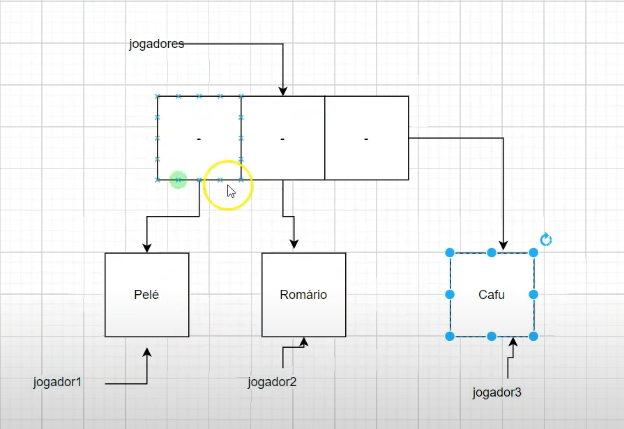

# Associação



A associação é um relacionamento entre duas classes onde uma classe usa a outra. É uma relação "tem um" (has-a). Por exemplo, uma classe `Time` pode ter uma associação com uma classe `Jogador`, indicando que um time tem um jogador.

## Associação unidirecional (um-para-muitos)

A associação unidirecional é quando uma classe conhece outra, mas a outra não conhece a primeira. Por exemplo, um `Time` pode conhecer seus `Jogadores`, mas os `Jogadores` não precisam conhecer o `Time`.

```java
class Jogador {
    private String nome;

    public Jogador(String nome) {
        this.nome = nome;
    }

    public String getNome() {
        return nome;
    }
}
class Time {
    private List<Jogador> jogadores;

    public Time() {
        jogadores = new ArrayList<>();
    }

    public void adicionarJogador(Jogador jogador) {
        jogadores.add(jogador);
    }

    public List<Jogador> getJogadores() {
        return jogadores;
    }
}
```

## Associação unidirecional (muitos-para-um)

A associação unidirecional muitos-para-um é quando várias instâncias de uma classe estão associadas a uma única instância de outra classe. Por exemplo, vários `Jogadores` podem estar associados a um único `Time`.

```java
class Jogador {
    private String nome;
    private Time time;

    public Jogador(String nome, Time time) {
        this.nome = nome;
        this.time = time;
    }

    public String getNome() {
        return nome;
    }

    public Time getTime() {
        return time;
    }
}

class Time {
    private List<Jogador> jogadores;

    public Time() {
        jogadores = new ArrayList<>();
    }

    public void adicionarJogador(Jogador jogador) {
        jogadores.add(jogador);
    }

    public List<Jogador> getJogadores() {
        return jogadores;
    }
}
```

## Associação bidirecional

A associação bidirecional é quando duas classes conhecem uma à outra. Por exemplo, um `Time` conhece seus `Jogadores`, e cada `Jogador` conhece seu `Time`.

```java
class Jogador {
    private String nome;
    private Time time;

    public Jogador(String nome, Time time) {
        this.nome = nome;
        this.time = time;
    }

    public String getNome() {
        return nome;
    }

    public Time getTime() {
        return time;
    }
}
class Time {
    private List<Jogador> jogadores;

    public Time() {
        jogadores = new ArrayList<>();
    }

    public void adicionarJogador(Jogador jogador) {
        jogadores.add(jogador);
    }

    public List<Jogador> getJogadores() {
        return jogadores;
    }
}
```
