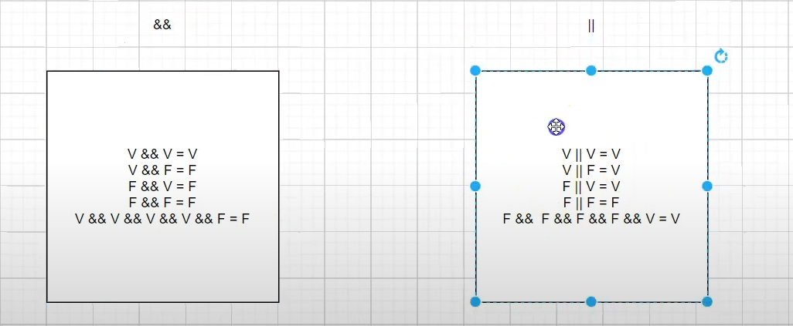

# Estruturas Condicionais

[estrutura condicionais w3schools](https://www.w3schools.com/java/java_conditions.asp)

If  
Só executa ele caso o valor seja verdadeiro. E sempre deverá ser retornado um boolean.

Else  
Se o retorno do if não for verdadeiro, o else SEMPRE será executado.

Else if  
Se o retorno do if não for verdadeiro, o else if será executado. E pode ser usado quantas vezes for necessário.

Operador Ternário
É uma forma simplificada de fazer um if else.

```java
double salario = 6000;
String mensagemDoar = "Vou doar 500 para as ONGs felinas";
String mensagemNaoDoar = "Ainda não consigo, mas vou ter";
String resultado = (salario > 5000) ? mensagemDoar : mensagemNaoDoar;
```

Tabela Verdade  
É uma tabela que mostra todas as possibilidades de combinações de valores de variáveis.



Switch  
É uma estrutura de controle que permite a execução de diferentes blocos de código, dependendo do valor de uma variável.

```java
        // Imprima o dia da semana, considerando 1 como domingo

        byte dia = 5;
        // char, int, byte, short, enum, String
        switch (dia) {
            case 1:
                System.out.println("Domingo");
                break;
            case 2:
                System.out.println("Segunda");
                break;

            case 3:
                System.out.println("Terça");
                break;

            case 4:
                System.out.println("Quarta");
                break;

            case 5:
                System.out.println("Quinta");
                break;

            case 6:
                System.out.println("Sexta");
                break;

            case 7:
                System.out.println("Sabado");
                break;

        }
```
