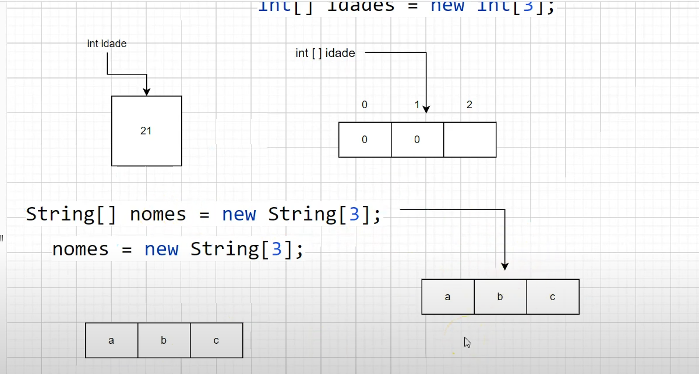

# Arrays

[Java arrays](https://www.w3schools.com/java/java_arrays.asp)

Arrays são usados para armazenar vários valores em uma única variável, em vez de declarar variáveis separadas para cada valor. Você declara um array com colchetes `[]`. e pode acessar um elemento específico do array referindo-se ao número do índice (arrays são objetos).

```java
        int[] idades = new int[3];
        idades[0] = 21;
        idades[1] = 15;
        idades[2] = 11;
        System.out.println(idades[0]);
        System.out.println(idades[1]);
        System.out.println(idades[2]);

```


