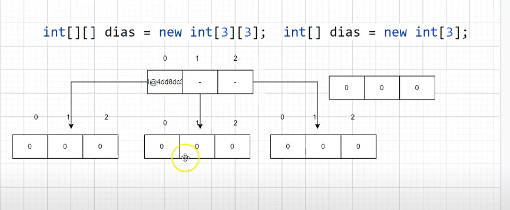
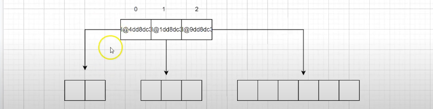

# Arrays Multi-dimensionais

[Java arrays](https://www.w3schools.com/java/java_arrays.asp)

Arrays multidimensionais são usados para armazenar valores em tabelas, ou seja, em linhas e colunas. Você declara um array multidimensional com colchetes `[][]`. e pode acessar um elemento específico do array referindo-se ao número do índice (arrays multidimensionais são objetos).



```java
        int[][] dias = new int[3][3];
        dias[0][0] = 31;
        dias[0][1] = 28;
        dias[0][2] = 31;

        dias[1][0] = 31;
        dias[1][1] = 28;
        dias[1][2] = 31;

        for (int i = 0; i < dias.length; i++) {
            for (int j = 0; j < dias[i].length; j++) {
                System.out.println(dias[i][j]);
            }

        }

```

```java
// Fazendo com foreach

        for(int[] arrayBase: dias){
            for (int num: arrayBase){
                System.out.println(num);

```

## Inicialização

```java
        int[] array = {1, 2, 3};

        int[][] arrayInt = new int[3][];
        arrayInt[0] = new int[2];
        arrayInt[1] = array;
        arrayInt[2] = new int[6];

        int[][] arrayInt2 = {{0, 0}, {1, 2, 3}, {1, 2, 3, 4, 5, 6}};

        for (int[] arrayBase : arrayInt2) {
            System.out.println("\n----");
            for (int num : arrayBase) {
                System.out.print(num);
            }
        }
    }
```


