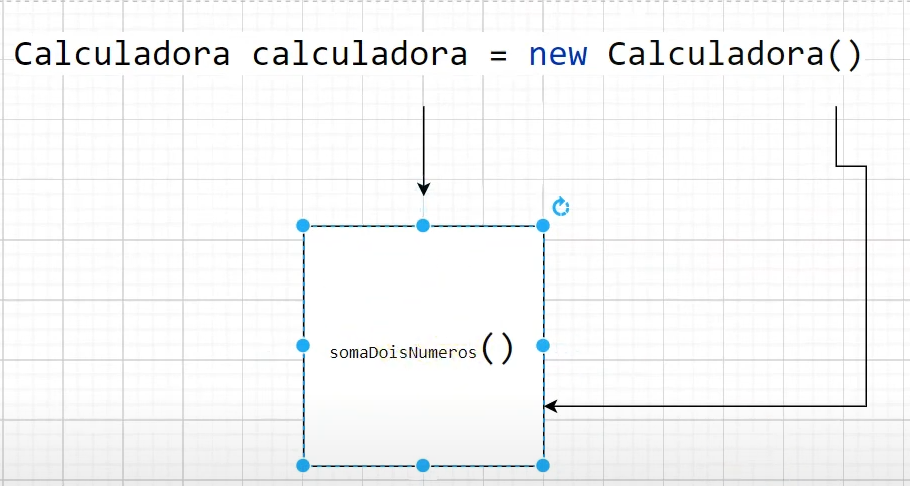
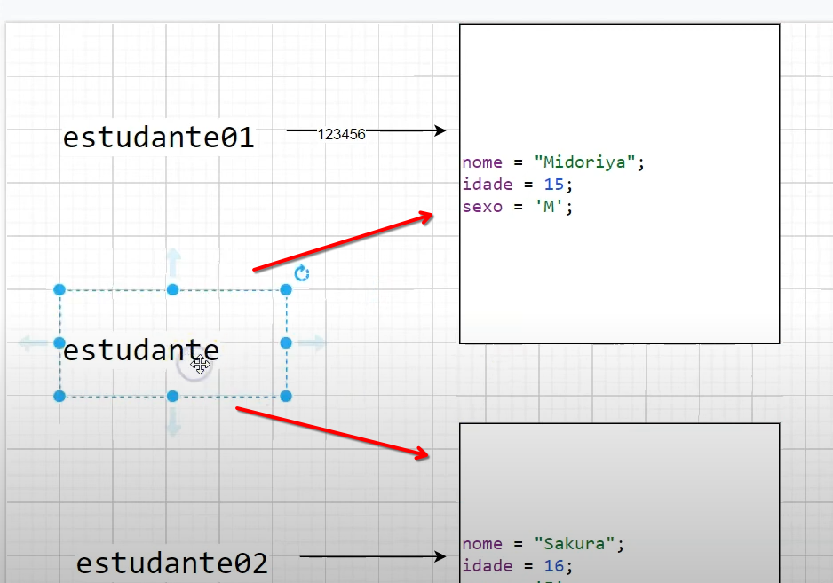

# Orientação Objetos

[Java POO](https://www.w3schools.com/java/java_oop.asp)

A programação orientada a objetos (OOP) é um modelo de programação que é organizado em torno de objetos e dados, em vez de ações e lógica. Em Java, um objeto é criado a partir de uma classe. Uma classe é um modelo que define os atributos e métodos de um objeto.

## Classes e Objetos

- **Classe**: Uma classe é um modelo para objetos, e um objeto é uma instância de uma classe. Por exemplo, uma classe chamada Pessoa, ela pode ter atributos como nome, idade, sexo, etc.

## Métodos

Um método é uma função que pertence a uma classe. Os métodos são usados para definir o comportamento de um objeto. Por exemplo, um método chamado andar, que faz com que a pessoa ande.
ELe é executado dentro do objteto.



Uma cópia das váriaveis do tipo primitivo são enviadas para o método, enquanto que os objetos são passados por referência. Isso significa que se você modificar um objeto dentro de um método, a modificação será refletida fora do método.

## Parâmetros tipos de referência

Os parâmetros de referência são usados para passar objetos para métodos. Quando um objeto é passado como parâmetro, o método pode modificar o objeto original. Isso é diferente dos tipos primitivos, que são passados por valor.  
Tomar cuidado com o que se modifica dentro do método, pois isso pode afetar o objeto original.  
As boas práticas você deve retornar um novo objeto.



## Parâmetro This

O parâmetro `this` é uma referência ao objeto atual. Ele é usado para acessar os atributos e métodos do objeto atual. Por exemplo, se você tiver um atributo chamado `age`, você pode acessá-lo usando `this.age`.

## VarArgs

VarArgs (Argumentos Variáveis) é uma funcionalidade do Java que permite passar um número variável de argumentos para um método. Isso é útil quando você não sabe quantos argumentos serão passados para o método.
Para declarar um método com VarArgs, você usa três pontos (`...`) antes do tipo do parâmetro. Por exemplo:

```java
public void metodoComVarArgs(int... numeros) {
    for (int numero : numeros) {
        System.out.println(numero);
    }
}
```

## Modificadores de Acesso e Getters/Setters

Os modificadores de acesso controlam a visibilidade dos atributos e métodos de uma classe. Existem quatro modificadores de acesso em Java:

- **public**: O atributo ou método é acessível de qualquer lugar.
- **private**: O atributo ou método é acessível apenas dentro da própria classe.
- **protected**: O atributo ou método é acessível dentro da própria classe, subclasses e classes do mesmo pacote.
- **default**: Se nenhum modificador for especificado, o atributo ou método é acessível apenas dentro do mesmo pacote.

Os getters e setters são métodos usados para acessar e modificar os atributos de uma classe. Eles são usados para encapsular os atributos e controlar o acesso a eles.
